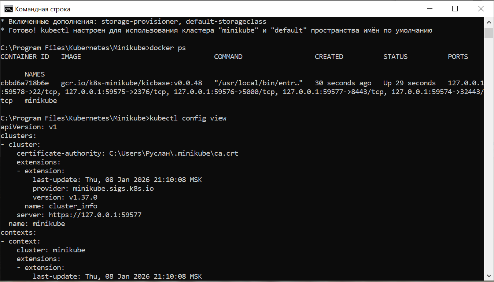
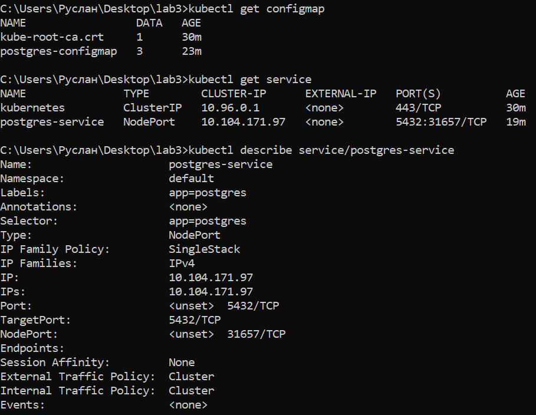
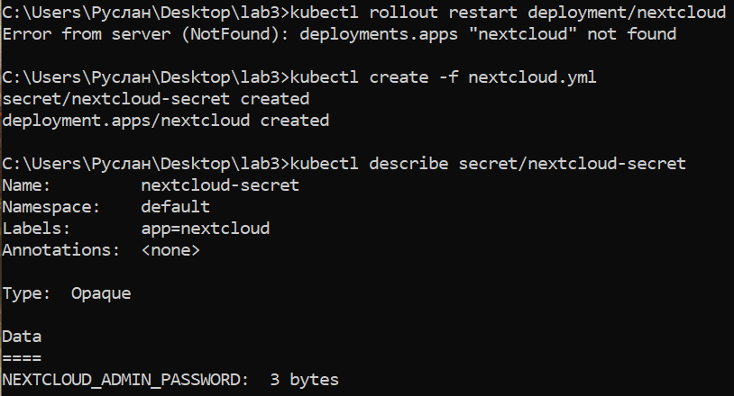
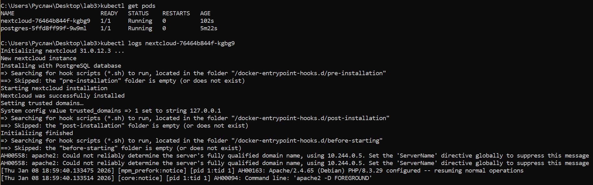

# Лабораторная работа №3  
## Kubernetes. Развёртывание сервисов с использованием ConfigMap и Secret

---

## Цель работы
Освоить базовые принципы работы с Kubernetes на локальной машине с использованием Minikube, научиться создавать и модифицировать ресурсы Kubernetes, а также корректно разделять конфигурационные и чувствительные данные с помощью ConfigMap и Secret.

---

## Используемые технологии
- Kubernetes
- Minikube
- Docker
- kubectl
- PostgreSQL
- Nextcloud

---

## Ход выполнения работы

### 1. Запуск Minikube и проверка окружения
Был установлен и запущен Minikube. Корректность работы проверена командами:

```bash
docker ps
kubectl config view
```



---

### 2. Развёртывание PostgreSQL

#### ConfigMap
В `pg_configmap.yml` хранится только не чувствительная информация:
- POSTGRES_DB

#### Secret
В `pg_secret.yml` вынесены чувствительные данные:
- POSTGRES_USER
- POSTGRES_PASSWORD

#### Service и Deployment
PostgreSQL опубликован через Service типа NodePort, а Deployment использует `envFrom` для подключения ConfigMap и Secret.

```bash
kubectl apply -f pg_configmap.yml
kubectl apply -f pg_secret.yml
kubectl apply -f pg_service.yml
kubectl apply -f pg_deployment.yml
```



---

### 3. Развёртывание Nextcloud

#### ConfigMap
В `nextcloud_configmap.yml` вынесены переменные окружения:
- NEXTCLOUD_UPDATE
- ALLOW_EMPTY_PASSWORD
- POSTGRES_HOST
- NEXTCLOUD_TRUSTED_DOMAINS
- NEXTCLOUD_ADMIN_USER

#### Secret
В `nextcloud_secret.yml` хранится пароль администратора:
- NEXTCLOUD_ADMIN_PASSWORD

#### Deployment
В Deployment добавлены проверки состояния:
- ReadinessProbe
- LivenessProbe

```bash
kubectl apply -f nextcloud_configmap.yml
kubectl apply -f nextcloud_secret.yml
kubectl apply -f nextcloud_deployment.yml
```



---

### 4. Проверка состояния ресурсов

```bash
kubectl get pods
kubectl get service
kubectl logs <pod_name>
```



Nextcloud успешно инициализировался и готов к работе.

---

## Ответы на вопросы

### Важен ли порядок применения манифестов?
Да, важен. ConfigMap и Secret должны быть созданы до Deployment, так как Deployment ссылается на них при запуске Pod’ов.

### Что произойдёт при масштабировании postgres-deployment в 0, а затем в 1?
При масштабировании в 0 Pod с БД будет удалён, соединение с Nextcloud потеряется. При возврате к 1 реплике база будет создана заново, и без persistent volume данные будут утеряны.


---
