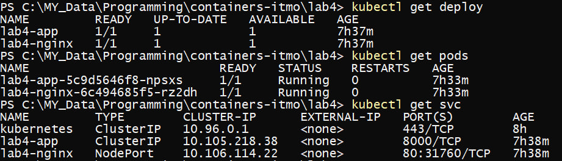
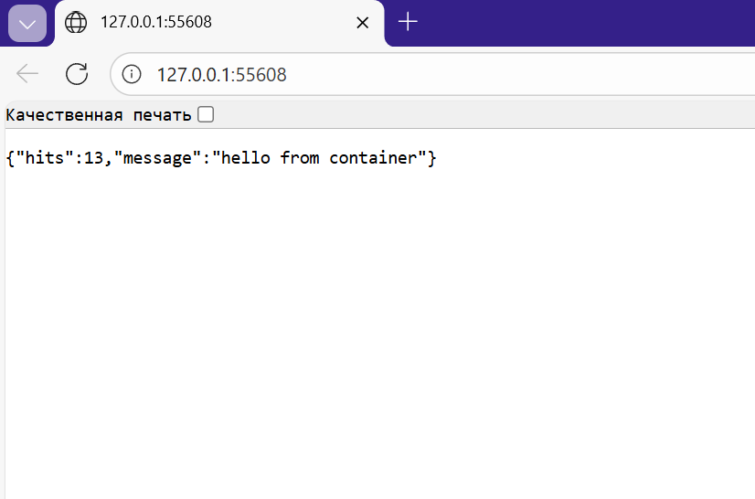
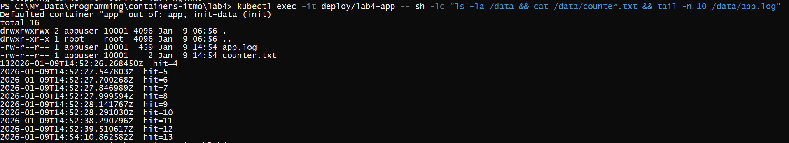
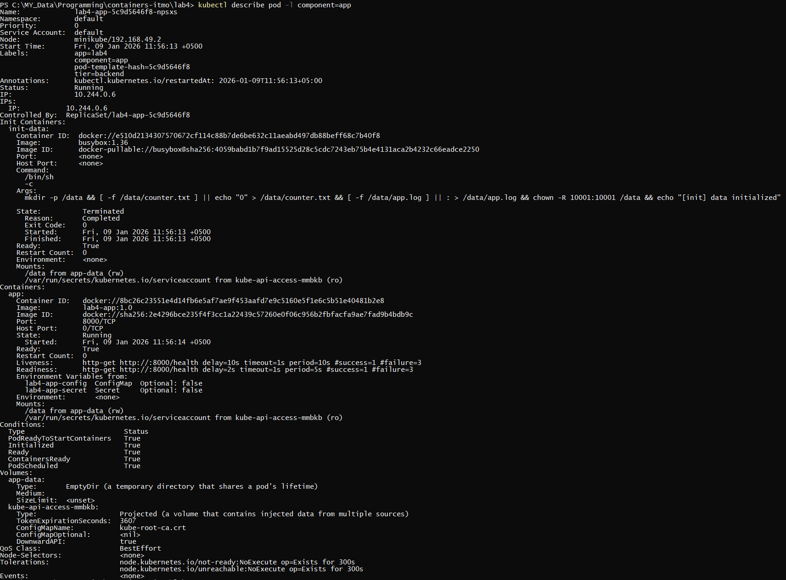

# ЛР4 — More Kubernetes

## Цель
Развернуть свой собственный сервис в **Kubernetes**, по аналогии с ЛР 3

---

## Архитектура
- **lab4-app** — приложение (кастомный образ `lab4-app:1.0`)
  - initContainer подготавливает `/data` (counter/log) и выставляет права
  - volume `emptyDir` монтируется в `/data`
  - readiness/liveness: `GET /health` на порту `8000`
- **lab4-nginx** — прокси (публичный образ `nginx:alpine`)
  - конфиг nginx из ConfigMap
  - readiness: `GET /health` на порту `8080`
  - наружу опубликован через **NodePort**

---

## Состав манифестов
- `app-configmap.yaml` — переменные окружения для приложения
- `app-secret.yaml` — Secret для приложения
- `app-deployment.yaml` — Deployment приложения + initContainer + volume + probes
- `app-service.yaml` — ClusterIP Service для доступа к приложению внутри кластера
- `nginx-configmap.yaml` — конфиг nginx
- `nginx-deployment.yaml` — Deployment nginx (+ readiness)
- `nginx-service.yaml` — NodePort Service для доступа к nginx извне

---

## Сборка образа приложения
Из папки с `Dockerfile`:
```bash
minikube image build -t lab4-app:1.0 .
```

---

## Запуск
Применить манифесты из папки manifests/:
```bash
kubectl apply -f manifests/
```
Проверить, что всё поднялось:
```
kubectl get deploy
kubectl get pods
kubectl get svc
```



---

## Проверка работы

### Открытие сервиса в браузере
```bash
minikube service lab4-nginx
```


---

### Проверка volume (/data)
Проверка, что файлы в `/data` созданы и обновляются:

```bash
kubectl exec -it deploy/lab4-app -- sh -lc "ls -la /data && cat /data/counter.txt && tail -n 10 /data/app.log"
```


---

## Describe Pod (init/volume/probes)
```bash
kubectl describe pod -l component=app
```

